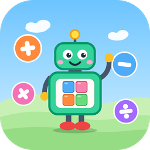

# Cube Counters!

A kid-friendly calculator where every number is a friendly robot carrying its counting cubes.

- Press a number and a robot appears holding that many cubes, and a cheerful British voice says the number.
- Robots dance in a sunny scene with rolling green hills, and the odd bird flies past.
- Press **=** for a trumpet fanfare, confetti, and the answer shown as cubes, tens bars and hundreds squares, read out loud.
- Watch the math happen: robots leap together to add, cubes pop away to take away, robots line up in groups to multiply, and a robot bursts into equal groups to divide.
- Decimals are shown at their true size, so 0.5 is half a cube.

## Challenge mode
Tap **Challenge** at the top to practise. The robots show a problem with their cubes, the voice reads it out, and you type the answer and press **=**.

- Pick a level: **+ to 10**, **+ − to 20**, **× groups**, **÷ sharing** or **? puzzles**.
- **? puzzles** are missing-number problems like 5 + ? = 8. One robot has an empty window, and it fills with cubes when you find the number.
- A right answer plays the animation and earns a star. Get a few in a row for a streak.
- A wrong answer gives a hint. After two tries, the robots work it out together.

## Prizes
Stars from Challenge mode unlock prizes:

- **Hats:** party hat (3 stars), crown (10), chef hat (18), top hat (20), pirate hat (28), wizard hat (35), cowboy hat (50), propeller cap (55)
- **Robot colors:** orange (5), teal (13), silver (25), midnight (40), gold (60)
- **Birds** that fly across the sky: red cardinal (8), yellow canary (16), bluebird (30), parrot (45)

## Build a Robot
Tap **Build a Robot** to design your own robot:

- Choose how many cubes it carries (0 to 100). Type a number, or press **+** and **−** one cube at a time.
- Pick the robot's color, a hat, and the color of its bricks, including rainbow bricks.
- Prizes you haven't earned yet show how many stars they need.
- Press **=** to show off your robot.

Stars, prizes, your level and your robot are saved on that computer.

## Play it
**In your browser:** https://lukeszboy-design.github.io/Cube-Counter/

## Download the app (version 1.1.1)
- **Windows:** [CubeCounters.exe](https://github.com/lukeszboy-design/Cube-Counter/releases/latest/download/CubeCounters.exe)
- **Mac with Apple chip (M1 or newer):** [CubeCounters-mac-AppleSilicon.zip](https://github.com/lukeszboy-design/Cube-Counter/releases/latest/download/CubeCounters-mac-AppleSilicon.zip)
- **Older Intel Mac:** [CubeCounters-mac-Intel.zip](https://github.com/lukeszboy-design/Cube-Counter/releases/latest/download/CubeCounters-mac-Intel.zip)

The apps load the newest version of the website each time they open, and use a built-in copy when there's no internet.

**Opening it the first time**
- Windows: if you see "Windows protected your PC", click **More info**, then **Run anyway**.
- Mac: unzip, drag the app into Applications, then right-click it and choose **Open**, then **Open** again.

Voice recorded with [Chatterbox](https://github.com/resemble-ai/chatterbox) by Resemble AI, an open-source (MIT) text-to-speech model, using a British voice made with [Kokoro](https://github.com/hexgrad/kokoro) as the voice sample.
